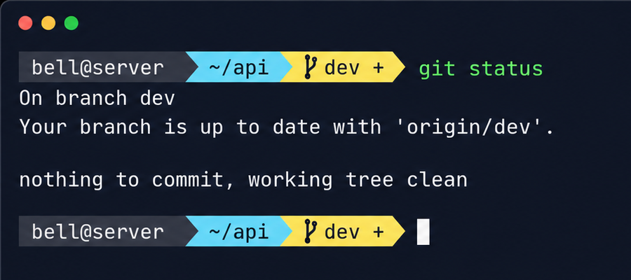
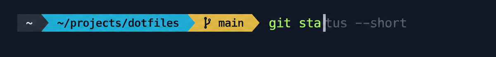
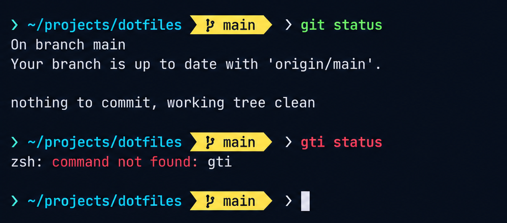

# easy-command

One command to configure a polished Zsh terminal with Oh My Zsh, the `agnoster` theme, Git status, command suggestions, Tab completion, and syntax highlighting.

> 一条命令配置统一的 Zsh 终端：Oh My Zsh、`agnoster` 主题、Git 状态、历史命令建议、Tab 补全与命令语法高亮。

## Preview

> 效果预览。

### Git branch and working-tree status

> Git 分支与工作区状态。



### History-based command suggestions

> 历史命令自动建议。



### Syntax highlighting and error feedback

> 命令语法高亮与错误提示。



## Quick start

> 快速开始。

Install the latest version:

> 安装最新版本：

```bash
curl -fsSL https://raw.githubusercontent.com/UnionSchool/easy-command/main/install.sh | bash -s -- --yes
```

After installation, sign in again or run:

> 安装完成后重新登录，或运行：

```bash
exec zsh -l
```

## What you get

> 提供的能力。

- `agnoster`: shows the user, current path, Git branch, and working-tree status.<br>
  `agnoster`：显示用户名、路径、Git 分支和工作区状态。
- `zsh-autosuggestions`: shows gray suggestions from command history; press `→` or `Ctrl+E` to accept.<br>
  `zsh-autosuggestions`：从历史命令显示灰色建议，按 `→` 或 `Ctrl+E` 接受。
- `zsh-syntax-highlighting`: valid commands are green; unknown commands are bold red.<br>
  `zsh-syntax-highlighting`：有效命令绿色、未知命令红色加粗。
- Native Zsh completion: press `Tab` to complete commands, paths, and Git subcommands; press it twice for candidates.<br>
  Zsh 原生补全：按 `Tab` 补全命令、路径和 Git 子命令，连按两次显示候选项。
- Shared history: the latest 10,000 commands are shared between terminal sessions.<br>
  共享历史：多个终端会话共享最近 10,000 条命令。

## Options

> 参数。

```bash
# Configure a specific user / 指定目标用户
bash install.sh --yes --user bell

# Keep the current login shell / 不改变默认登录 Shell
bash install.sh --yes --no-chsh

# Remove only the configuration block managed by easy-command / 删除本工具管理的 .zshrc 区块
bash install.sh --uninstall
```

## Supported platforms

> 支持范围。

- macOS: Homebrew must already be installed.<br>
  macOS：要求已安装 Homebrew。
- Ubuntu / Debian: dependencies are installed with `apt-get`.<br>
  Ubuntu / Debian：使用 `apt-get` 安装依赖。

The script needs `sudo` to install packages and change the default shell. Without sudo access, use `--no-chsh` and have an administrator install Zsh first.

> 脚本需要 `sudo` 来安装软件包和切换默认 Shell。没有 sudo 权限时，可加 `--no-chsh`，并由管理员预先安装 Zsh。

## Configuration and rollback

> 配置与回退。

Installed files:

> 安装内容位于：

```text
~/.easy-command/oh-my-zsh
~/.zshrc
~/.zsh_history
```

Before each `.zshrc` update, the script creates a timestamped backup. `--uninstall` removes only the configuration block managed by easy-command; it does not remove Oh My Zsh, plugins, or other user settings.

> 每次更新 `.zshrc` 前，脚本会创建带时间戳的备份。`--uninstall` 只删除由 easy-command 管理的配置块，不会删除 Oh My Zsh、插件或用户自己的其他配置。

## Security

> 安全说明。

For a first-time trial, download and inspect the script before running it:

> 首次试用建议先下载并审阅脚本：

```bash
curl -fsSLO https://raw.githubusercontent.com/UnionSchool/easy-command/main/install.sh
less install.sh
bash install.sh --yes
```

For production, pin a release tag instead of running `main` directly:

> 生产环境建议固定到发布标签，而不是直接使用 `main`：

```bash
curl -fsSL https://raw.githubusercontent.com/UnionSchool/easy-command/v1.0.3/install.sh | bash -s -- --yes
```

## License

[MIT](LICENSE)
